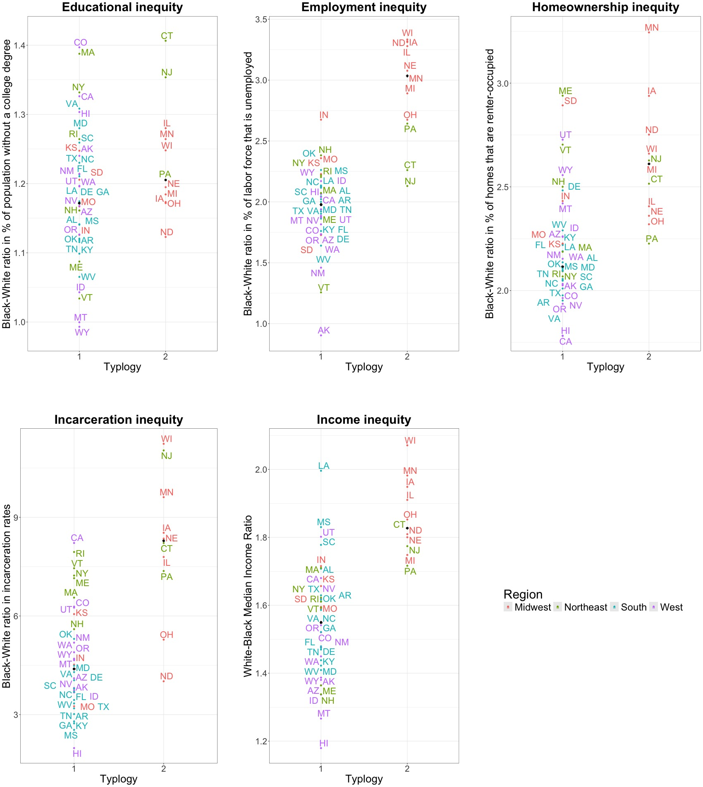
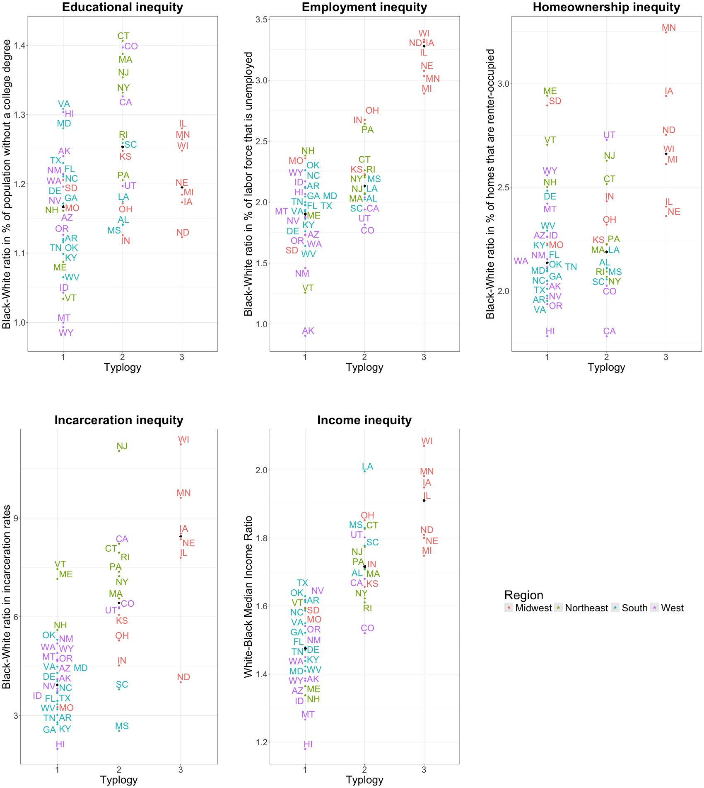
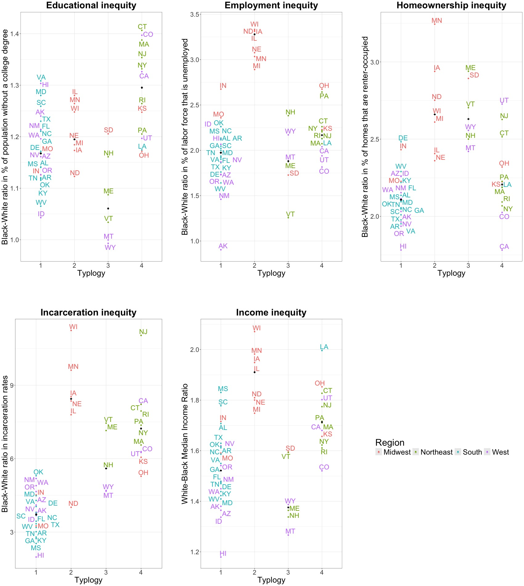
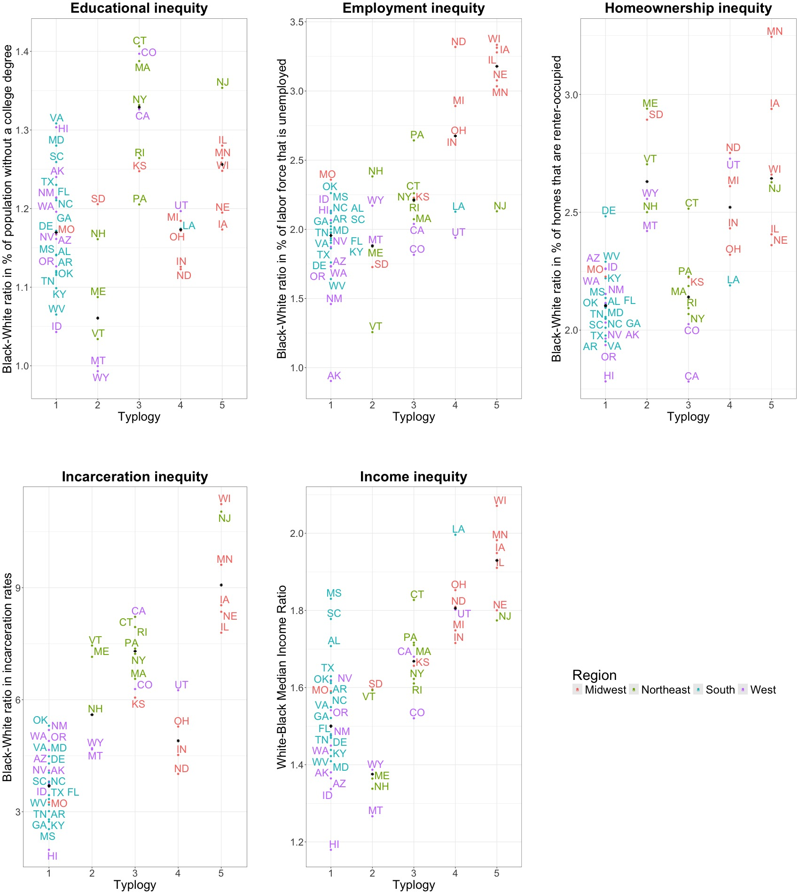

```{r setup, include=FALSE}
knitr::opts_chunk$set(echo = TRUE, warning = FALSE, message = FALSE)
```

## Import data

### Install libraries

```{r}
library(tidyverse)
library(statebins)
library(ggrepel)
library(cowplot)
library(knitr)
library(magrittr)
library(dplyr)
library(mapproj)
library(usmap)
```

### Import LPA results 

```{r}
# Import LPA results
lpa_results <- read.csv("../3. Cleaned data files/all_class_pred_4-2-24.csv")

# Factor data
lpa_results$two_class_pred<-as.factor(lpa_results$two_class_pred)
lpa_results$three_class_pred<-as.factor(lpa_results$three_class_pred)
lpa_results$four_class_pred<-as.factor(lpa_results$four_class_pred)
lpa_results$five_class_pred<-as.factor(lpa_results$five_class_pred)

#Recode data to switch 1 and 2 for three_class_pred for visualization purposes 
lpa_results_2 <- lpa_results %>% mutate(three_class_pred_reordered = 
                                          case_when(three_class_pred == 2 ~ 1,
                                                    three_class_pred == 1 ~ 2,
                                                    three_class_pred == 3 ~ 3))
#Factor data
lpa_results_2$three_class_pred_reordered<-as.factor(lpa_results_2$three_class_pred_reordered)

# Save as dataframe
lpa_results_2<-as.data.frame(lpa_results_2)
```

### Import structural racism domain data

```{r}
# Import structural racism domain data
structural_racism <- read.csv("../3. Cleaned data files/structural_racism_no_dc_3-30-24.csv")

# Merge structural racism domain & LPA Result datasets
structural_racism_with_lpa <- merge(structural_racism, lpa_results_2, by.x = "state", by.y = "state")
```

### Import US Census region & division data

Download file on US Census Regions & Divisions from https://github.com/cphalpert/census-regions/blob/master/us%20census%20bureau%20regions%20and%20divisions.csv

```{r}
# Import data on US Census Bureau region & division
us_census<- read.csv("../2. Raw data files/us_census_bureau_regions_and_divisions.csv")

# Remove DC
us_census<- us_census %>% filter(State !="District of Columbia")

# Merge with existing dataset
lpa_results_r <- merge(structural_racism_with_lpa, us_census, by.x = "state", by.y = "State")
```

## Maps

### Add additional data needed for mapping

```{r}
# Get centroids
centroid_labels <- usmapdata::centroid_labels("states")

# Subset into 2 datasets
centroid_labels_most <- centroid_labels[!(centroid_labels$abbr %in% 
                                            c("VT", "NH", "MA", "RI", "CT", 
                                              "NJ", "DE", "MD", "HI")),]

centroid_labels_east <- centroid_labels[(centroid_labels$abbr %in% 
                                            c("VT", "NH", "MA", "RI", "CT", 
                                              "NJ", "DE", "MD")),]

centroid_labels_hi <- centroid_labels[(centroid_labels$abbr == "HI"),]

# Combine centroid_labels_most with lpa_results_r
most_states <- merge(lpa_results_r, centroid_labels_most, by.x = "state", by.y = "full")

# Combine centroid_labels_east with lpa_results_r and reorder
east_states <- merge(lpa_results_r, centroid_labels_east, by.x = "state", by.y = "full")
east_states_ordered <- east_states[c(8,5,4,7,1,6,2,3),]

# Combine centroid_labels_hi with lpa_results_r
hi_state <- merge(lpa_results_r, centroid_labels_hi, by.x = "state", by.y = "full")
```


### Map of 2-class model

```{r}
update_geom_defaults("text", list(size= 7))
                     
viz1 <-  plot_usmap(regions = "states", 
             labels = FALSE, 
             data = lpa_results_r,
             values = "two_class_pred") +
  scale_fill_manual(values = c("1"= "#E69F00", "2" = "#56B4E9"), 
                    name = "Typology",
                    na.translate = F) + 
  theme(legend.position = "right", legend.text = element_text(size=22), 
        legend.title =element_text(size=22)) + 
  geom_text(data = most_states, 
            ggplot2::aes(x = x, y = y, 
                         label = abbr), color = "black") + 
  geom_segment(data = east_states_ordered, 
            ggplot2::aes(x = x, xend = 2600000, y = y, yend = (-3:4)*(-150000), 
                         label = abbr), color = "black") + 
  geom_text(data = east_states_ordered, 
            ggplot2::aes(x=2700000, y=(-3:4)*(-150000), label = abbr), color = "black") +
  geom_segment(data = hi_state, 
            ggplot2::aes(x = x, xend = (-60000), y = y, yend = (-2300000), 
                         label = abbr), color = "black") +  
  geom_text(data = hi_state, 
            ggplot2::aes(x=(-50000), y=(-2400000), label = abbr), color = "black")

jpeg(filename= "alt2_map_2_class.jpeg", width= 900, height= 600, quality= 100)
print(viz1)
```

### Map of 3-class model

```{r}
viz2 <-  plot_usmap(regions = "states", 
             labels = FALSE, 
             data = lpa_results_r,
             values = "three_class_pred_reordered") +
  scale_fill_manual(values = c("1"= "#CCCCFF", "2" = "#9999FF", "3" = "#6666FF"), 
                    name = "Typology", na.translate = F) + 
  theme(legend.position = "right", legend.text = element_text(size=22), legend.title = element_text(size=22)) + 
  geom_text(data = most_states, 
            ggplot2::aes(x = x, y = y, 
                         label = abbr), color = "black") + 
  geom_segment(data = east_states_ordered, 
            ggplot2::aes(x = x, xend = 2600000, y = y, yend = (-3:4)*(-150000), 
                         label = abbr), color = "black") + 
  geom_text(data = east_states_ordered, 
            ggplot2::aes(x=2700000, y=(-3:4)*(-150000), label = abbr), color = "black") +
  geom_segment(data = hi_state, 
            ggplot2::aes(x = x, xend = (-60000), y = y, yend = (-2300000), 
                         label = abbr), color = "black") +  
  geom_text(data = hi_state, 
            ggplot2::aes(x=(-50000), y=(-2400000), label = abbr), color = "black")
  
jpeg(filename= "alt2_map_3_class.jpeg", width= 900, height= 600, quality= 100)
print(viz2)
```

### Map of 4-class model

```{r}
viz3 <-  plot_usmap(regions = "states", 
             labels = FALSE, 
             data = lpa_results_r,
             values = "four_class_pred") +
  scale_fill_manual(values = c("1"= "#E69F00", "2" = "#56B4E9", "3" = "#009E73", 
                               "4" = "#F0E442"), name = "Typology", 
                    na.translate = F) + 
  theme(legend.position = "right", legend.text = element_text(size=22), legend.title = element_text(size=22)) + 
  geom_text(data = most_states, 
            ggplot2::aes(x = x, y = y, 
                         label = abbr), color = "black") + 
  geom_segment(data = east_states_ordered, 
            ggplot2::aes(x = x, xend = 2600000, y = y, yend = (-3:4)*(-150000), 
                         label = abbr), color = "black") + 
  geom_text(data = east_states_ordered, 
            ggplot2::aes(x=2700000, y=(-3:4)*(-150000), label = abbr), color = "black") +
  geom_segment(data = hi_state, 
            ggplot2::aes(x = x, xend = (-60000), y = y, yend = (-2300000), 
                         label = abbr), color = "black") +  
  geom_text(data = hi_state, 
            ggplot2::aes(x=(-50000), y=(-2400000), label = abbr), color = "black")

jpeg(filename= "alt2_map_4_class.jpeg", width= 900, height= 600, quality= 100)
print(viz3)
```

### Map of 5-class model

```{r}
viz4 <-  plot_usmap(regions = "states", 
             labels = FALSE, 
             data = lpa_results_r,
             values = "five_class_pred") +
  scale_fill_manual(values = c("1"= "#E69F00", "2" = "#56B4E9", "3" = "#009E73", 
                               "4" = "#F0E442", "5" = "#CC79A7"), name = "Typology", 
                    na.translate = F) + 
  theme(legend.position = "right", legend.text = element_text(size=22), legend.title = element_text(size=22)) + 
  geom_text(data = most_states, 
            ggplot2::aes(x = x, y = y, 
                         label = abbr), color = "black") + 
  geom_segment(data = east_states_ordered, 
            ggplot2::aes(x = x, xend = 2600000, y = y, yend = (-3:4)*(-150000), 
                         label = abbr), color = "black") + 
  geom_text(data = east_states_ordered, 
            ggplot2::aes(x=2700000, y=(-3:4)*(-150000), label = abbr), color = "black") +
  geom_segment(data = hi_state, 
            ggplot2::aes(x = x, xend = (-60000), y = y, yend = (-2300000), 
                         label = abbr), color = "black") +  
  geom_text(data = hi_state, 
            ggplot2::aes(x=(-50000), y=(-2400000), label = abbr), color = "black")

jpeg(filename= "alt2_map_5_class.jpeg", width= 900, height= 600, quality= 100)
print(viz4)
```

## Cluster plots

$~$

### Cluster plot of 2-class model

```{r}
#Create new dataset with median values for each variable for each class

# Copy dataset
med_data <- lpa_results_r

# Subset by class
class1<- med_data %>% filter(two_class_pred == 1)
class2<- med_data %>% filter(two_class_pred == 2)

class1<- class1 %>% mutate(
  education_median = median(no_college_RR, na.rm= TRUE), 
  unemployment_median = median(unemployment_RR, na.rm= TRUE), 
  income_median = median(median_income_ratio, na.rm = TRUE), 
  renters_median = median(renters_RR, na.rm = TRUE), 
  incarceration_median = median(incarceration_RR, na.rm= TRUE)
)

class2<- class2 %>% mutate(
  education_median = median(no_college_RR, na.rm= TRUE), 
  unemployment_median = median(unemployment_RR, na.rm= TRUE), 
  income_median = median(median_income_ratio, na.rm = TRUE), 
  renters_median = median(renters_RR, na.rm = TRUE), 
  incarceration_median = median(incarceration_RR, na.rm= TRUE)
)

# Combine datasets
all_classes<- rbind(class1, class2)
```

```{r}
# Create legend function
legend_function <- function(all_classes, class_prediction){
  legendplot<- ggplot(all_classes, aes(class_prediction, no_college_RR,label=State.Code, color=Region)) +
  geom_point() +
  geom_text_repel(max.overlaps = 100, nudge_x=.05) +
  xlab("Typlogy") +
  ylab("Black-White ratio in % of population without a college degree") +
  ggtitle("Education inequity") + 
  theme(legend.position = "bottom", text= element_text(size=30))
}
```

```{r}
# Create education function
education_function <- function(all_classes, class_prediction){
  p2 <- ggplot(all_classes, aes(class_prediction, no_college_RR,label=State.Code, color=Region)) +
  ylim(.98,1.42) +
  geom_point() +
  geom_text_repel(label=all_classes$State.Code, size=7.75, max.overlaps=20, nudge_x=.005, nudge_y=.005, segment.color= "transparent") +
  xlab("Typlogy") +
  ylab("Black-White ratio in % of population without a college degree") +
  ggtitle("Educational inequity") + 
  geom_point(data= all_classes, aes(x=class_prediction, y=education_median), col= "black", pch = 8) +
  theme_bw() +
  theme(plot.title = element_text(face= "bold", hjust = .5, size=30), legend.position = "none", text= element_text(size=26),
        axis.title.y = (text=element_text(size=26)), axis.title.x=(text=element_text(size=26)))
}
```

```{r}
# Create unemployment function
unemployment_function <- function(all_classes, class_prediction){
  p3 <- ggplot(all_classes, aes(class_prediction, unemployment_RR,label=State.Code, color=Region, show.legend = FALSE)) +
  ylim(.90,3.4) +
  geom_point() +
  geom_text_repel(label=all_classes$State.Code, size=7.75, max.overlaps=20, nudge_x=.005, nudge_y=.005, segment.color= "transparent") +
  xlab("Typlogy") +
  ylab("Black-White ratio in % of labor force that is unemployed") +
  ggtitle("Employment inequity") + 
  geom_point(data= all_classes, aes(x=class_prediction, y=unemployment_median), col= "black", pch = 8) +
  theme_bw() + 
  theme(plot.title = element_text(face= "bold", hjust = .5, size=30), legend.position = "none", text= element_text(size=26),
        axis.title.y = (text=element_text(size=26)), axis.title.x=(text=element_text(size=26)))
}
```

```{r}
# Create income function
income_function <- function(all_classes, class_prediction){
  p4 <- ggplot(all_classes, aes(class_prediction, median_income_ratio,label=State.Code, color=Region, show.legend = FALSE)) +
  geom_point() +
  geom_text_repel(label=all_classes$State.Code, size=7.75, max.overlaps=20, nudge_x=.005, nudge_y=.005, segment.color= "transparent") +
  xlab("Typlogy") +
  ylab("White-Black Median Income Ratio") +
  ggtitle("Income inequity") + 
  geom_point(data= all_classes, aes(x=class_prediction, y=income_median), col= "black", pch = 8) +
  theme_bw() +
  theme(plot.title = element_text(face= "bold", hjust = .5, size=30), legend.position = "none", text= element_text(size=26),
        axis.title.y = (text=element_text(size=26)), axis.title.x=(text=element_text(size=26)))
}
```

```{r} 
# Create homeownership function
homeownership_function <- function(all_classes, class_prediction){
p5 <- ggplot(all_classes, aes(class_prediction, renters_RR,label=State.Code, color=Region, show.legend = FALSE)) +
  geom_point() +
  geom_text_repel(label=all_classes$State.Code, size=7.75, max.overlaps=20, nudge_x=.005, nudge_y=.005, segment.color= "transparent") +
  xlab("Typlogy") +
  ylab("Black-White ratio in % of homes that are renter-occupied") + 
  ggtitle("Homeownership inequity") +
  geom_point(data= all_classes, aes(x=class_prediction, y=renters_median), col= "black", pch = 8) +
  theme_bw() +
    theme(plot.title = element_text(face= "bold", hjust = .5, size=30), legend.position = "none", text= element_text(size=26), axis.title.y = (text=element_text(size=26)), axis.title.x=(text=element_text(size=26)))
}
```

```{r}
# Create incarceration function
incarceration_function <- function(all_classes, class_prediction){
p6 <- ggplot(all_classes, aes(class_prediction, incarceration_RR,label=State.Code, color=Region, show.legend = FALSE)) +
  geom_point() +
  geom_text_repel(label=all_classes$State.Code, size=7.75, max.overlaps=20, nudge_x=.005, nudge_y=.005, segment.color= "transparent") +
  xlab("Typlogy") +
  ylab("Black-White ratio in incarceration rates") + 
  ggtitle("Incarceration inequity") + 
  geom_point(data= all_classes, aes(x=class_prediction, y=incarceration_median), col= "black", pch = 8) +
  theme_bw() + 
  theme(plot.title = element_text(face= "bold", hjust = .5, size=30), legend.position = "none", text= element_text(size=26),
        axis.title.y = (text=element_text(size=26)), axis.title.x=(text=element_text(size=26)))
}
```

```{r}
# Call functions
legendplot <- legend_function(all_classes, all_classes$two_class_pred)
p2 <- education_function(all_classes, all_classes$two_class_pred)
p3 <- unemployment_function(all_classes, all_classes$two_class_pred)
p4 <- income_function(all_classes, all_classes$two_class_pred)
p5 <- homeownership_function(all_classes, all_classes$two_class_pred)
p6 <- incarceration_function(all_classes, all_classes$two_class_pred)
```

```{r}
# Create vertical plot (paper-style)
legend_1<- get_legend(legendplot +
                     guides(color=guide_legend(nrow=1)) +
                     theme(legend.position="right", legend.key.size= unit(.75, "cm") ))

prow<- plot_grid(p2, NA, p3, NA, p5, NA, NA, NA, NA, NA, p6, NA, p4, NA, legend_1, nrow=3, rel_widths=c(1, .1, 1, .1, 1, .1, .1, .1, .1, .1, 1, .1, 1, .1, 1), rel_heights= c(1, .1, 1))
  
paper<- plot_grid(prow, ncol=1)

jpeg(filename= "cluster_plot_2_class.jpeg", width= 1700, height= 1900, quality= 100)
print(paper)
```

```{r}
# Display vertical plot

```

```{r}
# Create horizontal plot (poster-style)
# legend<- get_legend(legendplot +
#                     guides(color=guide_legend(nrow=1)) +
#                     theme(legend.position="bottom", legend.key.size= unit(.75, "cm") ))

# prow<- plot_grid(NA, p2, NA, p3, NA, p5, NA, p6, NA, p4, NA, nrow=1, rel_widths=c(.1, 1, .1, 1, .1, 1, .1, 1, .1, 1, .1))
  
# poster<- plot_grid(prow, legend, ncol=1, rel_heights = c(1, .1))

# poster 

# jpeg(filename= "two_class_cluster_plot_poster_grid.jpeg", width= 3000, height= 1200, quality= 100)
# print(poster)
```

$~$

### Cluster plot of 3-class model

```{r}
#Create new dataset with median values for each variable for each class

# Copy dataset
med_data <- lpa_results_r

# Subset by class
class1<- med_data %>% filter(three_class_pred_reordered == 1)
class2<- med_data %>% filter(three_class_pred_reordered == 2)
class3<- med_data %>% filter(three_class_pred_reordered == 3)

class1<- class1 %>% mutate(
  education_median = median(no_college_RR, na.rm= TRUE), 
  unemployment_median = median(unemployment_RR, na.rm= TRUE), 
  income_median = median(median_income_ratio, na.rm = TRUE), 
  renters_median = median(renters_RR, na.rm = TRUE), 
  incarceration_median = median(incarceration_RR, na.rm= TRUE)
)

class2<- class2 %>% mutate(
  education_median = median(no_college_RR, na.rm= TRUE), 
  unemployment_median = median(unemployment_RR, na.rm= TRUE), 
  income_median = median(median_income_ratio, na.rm = TRUE), 
  renters_median = median(renters_RR, na.rm = TRUE), 
  incarceration_median = median(incarceration_RR, na.rm= TRUE)
)

class3<- class3 %>% mutate(
  education_median = median(no_college_RR, na.rm= TRUE), 
  unemployment_median = median(unemployment_RR, na.rm= TRUE), 
  income_median = median(median_income_ratio, na.rm = TRUE), 
  renters_median = median(renters_RR, na.rm = TRUE), 
  incarceration_median = median(incarceration_RR, na.rm= TRUE)
)

# Combine datasets
all_classes<- rbind(class1, class2, class3)
```

```{r}
# Call functions
legendplot <- legend_function(all_classes, all_classes$three_class_pred_reordered)
p2 <- education_function(all_classes, all_classes$three_class_pred_reordered)
p3 <- unemployment_function(all_classes, all_classes$three_class_pred_reordered)
p4 <- income_function(all_classes, all_classes$three_class_pred_reordered)
p5 <- homeownership_function(all_classes, all_classes$three_class_pred_reordered)
p6 <- incarceration_function(all_classes, all_classes$three_class_pred_reordered)
```

```{r}
# Create vertical plot (paper-style)
legend_1<- get_legend(legendplot +
                     guides(color=guide_legend(nrow=1)) +
                     theme(legend.position="right", legend.key.size= unit(.75, "cm") ))

prow<- plot_grid(p2, NA, p3, NA, p5, NA, NA, NA, NA, NA, p6, NA, p4, NA, legend_1, nrow=3, rel_widths=c(1, .1, 1, .1, 1, .1, .1, .1, .1, .1, 1, .1, 1, .1, 1), rel_heights= c(1, .1, 1))
  
paper<- plot_grid(prow, ncol=1)

jpeg(filename= "cluster_plot_3_class.jpeg", width= 1700, height= 1900, quality= 100)
print(paper)
```

```{r}
# Display vertical plot

```

$~$

### Cluster plot of 4-class model

```{r}
#Create new dataset with median values for each variable for each class

# Copy dataset
med_data <- lpa_results_r

# Subset by class
class1<- med_data %>% filter(four_class_pred == 1)
class2<- med_data %>% filter(four_class_pred == 2)
class3<- med_data %>% filter(four_class_pred == 3)
class4<- med_data %>% filter(four_class_pred == 4)


class1<- class1 %>% mutate(
  education_median = median(no_college_RR, na.rm= TRUE), 
  unemployment_median = median(unemployment_RR, na.rm= TRUE), 
  income_median = median(median_income_ratio, na.rm = TRUE), 
  renters_median = median(renters_RR, na.rm = TRUE), 
  incarceration_median = median(incarceration_RR, na.rm= TRUE)
)

class2<- class2 %>% mutate(
  education_median = median(no_college_RR, na.rm= TRUE), 
  unemployment_median = median(unemployment_RR, na.rm= TRUE), 
  income_median = median(median_income_ratio, na.rm = TRUE), 
  renters_median = median(renters_RR, na.rm = TRUE), 
  incarceration_median = median(incarceration_RR, na.rm= TRUE)
)

class3<- class3 %>% mutate(
  education_median = median(no_college_RR, na.rm= TRUE), 
  unemployment_median = median(unemployment_RR, na.rm= TRUE), 
  income_median = median(median_income_ratio, na.rm = TRUE), 
  renters_median = median(renters_RR, na.rm = TRUE), 
  incarceration_median = median(incarceration_RR, na.rm= TRUE)
)

class4<- class4 %>% mutate(
  education_median = median(no_college_RR, na.rm= TRUE), 
  unemployment_median = median(unemployment_RR, na.rm= TRUE), 
  income_median = median(median_income_ratio, na.rm = TRUE), 
  renters_median = median(renters_RR, na.rm = TRUE), 
  incarceration_median = median(incarceration_RR, na.rm= TRUE)
)

# Combine datasets
all_classes<- rbind(class1, class2, class3, class4)
```

```{r}
# Call functions
legendplot <- legend_function(all_classes, all_classes$four_class_pred)
p2 <- education_function(all_classes, all_classes$four_class_pred)
p3 <- unemployment_function(all_classes, all_classes$four_class_pred)
p4 <- income_function(all_classes, all_classes$four_class_pred)
p5 <- homeownership_function(all_classes, all_classes$four_class_pred)
p6 <- incarceration_function(all_classes, all_classes$four_class_pred)
```

```{r}
# Create vertical plot (paper-style)
legend_1<- get_legend(legendplot +
                     guides(color=guide_legend(nrow=1)) +
                     theme(legend.position="right", legend.key.size= unit(.75, "cm") ))

prow<- plot_grid(p2, NA, p3, NA, p5, NA, NA, NA, NA, NA, p6, NA, p4, NA, legend_1, nrow=3, rel_widths=c(1, .1, 1, .1, 1, .1, .1, .1, .1, .1, 1, .1, 1, .1, 1), rel_heights= c(1, .1, 1))
  
paper<- plot_grid(prow, ncol=1)

jpeg(filename= "cluster_plot_4_class.jpeg", width= 1700, height= 1900, quality= 100)
print(paper)
```

```{r}
# Display vertical plot

```

### Cluster plot of 5-class model

```{r}
#Create new dataset with median values for each variable for each class

# Copy dataset
med_data <- lpa_results_r

# Subset by class
class1<- med_data %>% filter(five_class_pred == 1)
class2<- med_data %>% filter(five_class_pred == 2)
class3<- med_data %>% filter(five_class_pred == 3)
class4<- med_data %>% filter(five_class_pred == 4)
class5<- med_data %>% filter(five_class_pred == 5)

class1<- class1 %>% mutate(
  education_median = median(no_college_RR, na.rm= TRUE), 
  unemployment_median = median(unemployment_RR, na.rm= TRUE), 
  income_median = median(median_income_ratio, na.rm = TRUE), 
  renters_median = median(renters_RR, na.rm = TRUE), 
  incarceration_median = median(incarceration_RR, na.rm= TRUE)
)

class2<- class2 %>% mutate(
  education_median = median(no_college_RR, na.rm= TRUE), 
  unemployment_median = median(unemployment_RR, na.rm= TRUE), 
  income_median = median(median_income_ratio, na.rm = TRUE), 
  renters_median = median(renters_RR, na.rm = TRUE), 
  incarceration_median = median(incarceration_RR, na.rm= TRUE)
)

class3<- class3 %>% mutate(
  education_median = median(no_college_RR, na.rm= TRUE), 
  unemployment_median = median(unemployment_RR, na.rm= TRUE), 
  income_median = median(median_income_ratio, na.rm = TRUE), 
  renters_median = median(renters_RR, na.rm = TRUE), 
  incarceration_median = median(incarceration_RR, na.rm= TRUE)
)

class4<- class4 %>% mutate(
  education_median = median(no_college_RR, na.rm= TRUE), 
  unemployment_median = median(unemployment_RR, na.rm= TRUE), 
  income_median = median(median_income_ratio, na.rm = TRUE), 
  renters_median = median(renters_RR, na.rm = TRUE), 
  incarceration_median = median(incarceration_RR, na.rm= TRUE)
)

class5<- class5 %>% mutate(
  education_median = median(no_college_RR, na.rm= TRUE), 
  unemployment_median = median(unemployment_RR, na.rm= TRUE), 
  income_median = median(median_income_ratio, na.rm = TRUE), 
  renters_median = median(renters_RR, na.rm = TRUE), 
  incarceration_median = median(incarceration_RR, na.rm= TRUE)
)

# Combine datasets
all_classes<- rbind(class1, class2, class3, class4, class5)
```

```{r}
# Call functions
legendplot <- legend_function(all_classes, all_classes$five_class_pred)
p2 <- education_function(all_classes, all_classes$five_class_pred)
p3 <- unemployment_function(all_classes, all_classes$five_class_pred)
p4 <- income_function(all_classes, all_classes$five_class_pred)
p5 <- homeownership_function(all_classes, all_classes$five_class_pred)
p6 <- incarceration_function(all_classes, all_classes$five_class_pred)
```

```{r}
# Create vertical plot (paper-style)
legend_1<- get_legend(legendplot +
                     guides(color=guide_legend(nrow=1)) +
                     theme(legend.position="right", legend.key.size= unit(.75, "cm") ))

prow<- plot_grid(p2, NA, p3, NA, p5, NA, NA, NA, NA, NA, p6, NA, p4, NA, legend_1, nrow=3, rel_widths=c(1, .1, 1, .1, 1, .1, .1, .1, .1, .1, 1, .1, 1, .1, 1), rel_heights= c(1, .1, 1))
  
paper<- plot_grid(prow, ncol=1)

jpeg(filename= "cluster_plot_5_class.jpeg", width= 1700, height= 1900, quality= 100)
print(paper)
```

```{r}
# Display vertical plot

```

## Sankey plot

```{r, eval = T}
dat <- read.csv("../3. Cleaned data files/v4_all_class_pred_10-29-23.csv")

dat %<>% mutate(two_class_recoded = two_class_pred,
                three_class_recoded = case_when(three_class_pred == 2 ~ 1,
                                                three_class_pred == 3 ~ 2,
                                                three_class_pred == 1 ~ 3),

                four_class_recoded = case_when(four_class_pred == 3 ~ 0,
                                               four_class_pred == 1 ~ 1,
                                               four_class_pred == 2 ~ 2, 
                                               four_class_pred == 4 ~ 4),

                five_class_recoded = case_when(five_class_pred == 2 ~ 0, 
                                               five_class_pred == 5 ~ 2, 
                                               five_class_pred == 1 ~ 1, 
                                                five_class_pred == 3 ~ 3,
                                                five_class_pred == 4 ~ 4)
)

dat_long <- dat %>% select(-ends_with("pred")) %>% pivot_longer(cols = ends_with("recoded"), names_to = "model", values_to = "value")

dat_long %<>% mutate(model_f = factor(model, 
                                      levels = c("two_class_recoded", "three_class_recoded",
                                                 "four_class_recoded", "five_class_recoded")
                                      ),
                     model_num = case_when(model == "two_class_recoded" ~ 2, 
                                           model == "three_class_recoded" ~ 3, 
                                           model == "four_class_recoded" ~ 4, 
                                           model == "five_class_recoded" ~ 5)
                     )

dat_long %<>% rowwise() %>% mutate(value_jitter = value + rnorm(1, 0, 0.1))

dat_long %<>% group_by(state) %>% arrange(model_num) %>% mutate(model_5_value = last(value))

str(dat_long$model)
ggplot(dat_long, aes(x = model_num, y = value_jitter)) + 
  geom_point(aes(group = state, col = factor(model_5_value))) + 
  geom_line(aes(group = state, col = factor(model_5_value))) + 
  labs(x = "Number of latent classes", 
       y = "Assigned class indicator") + 
  scale_y_continuous(labels = c("A", "B", "C", "D", "E"), breaks = c(0, 1, 2, 3, 4)) + 
  theme_bw() + theme(legend.position="none")

ggsave(filename = "sankey-plot.png", device = "png", width = 7, height = 4.5, dpi = 300)
```